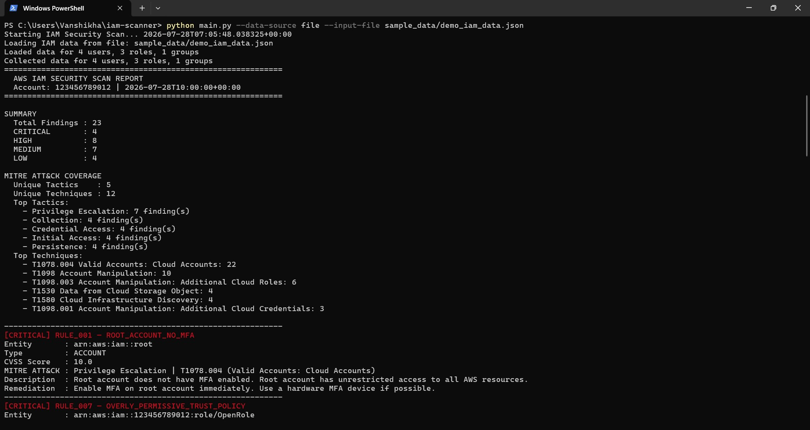
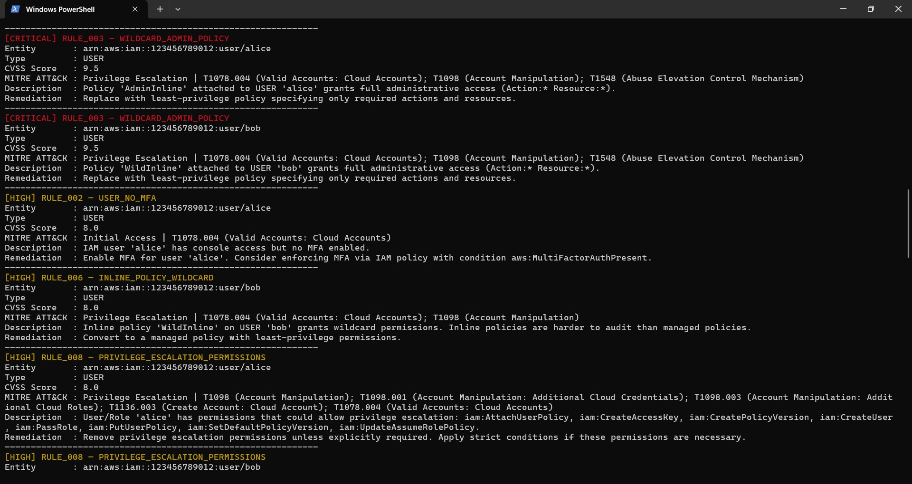
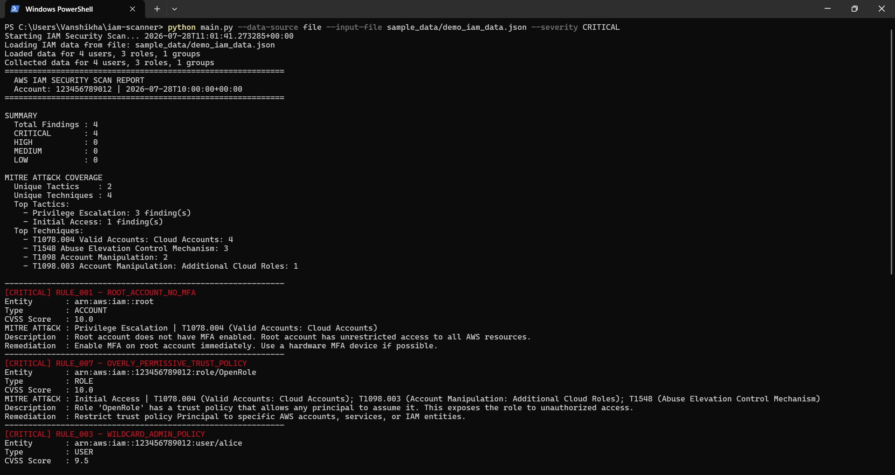
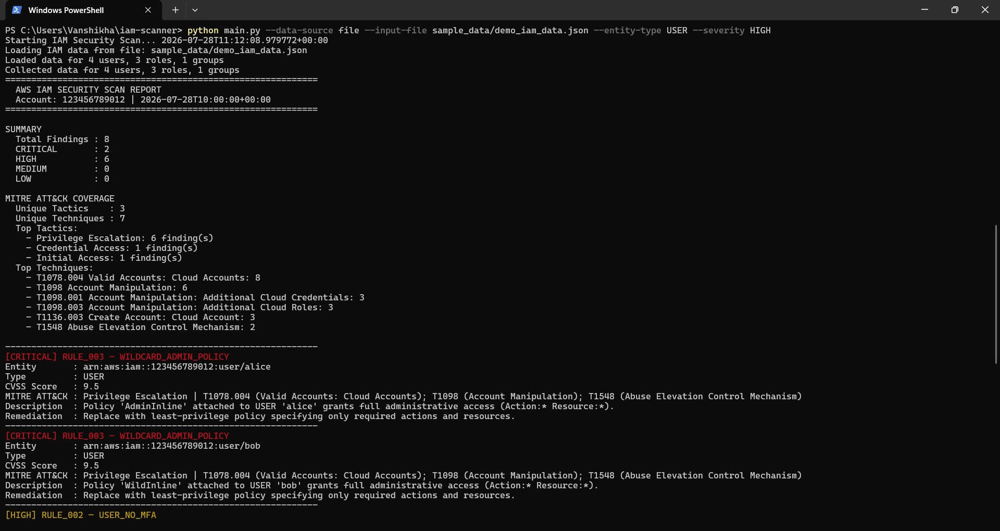
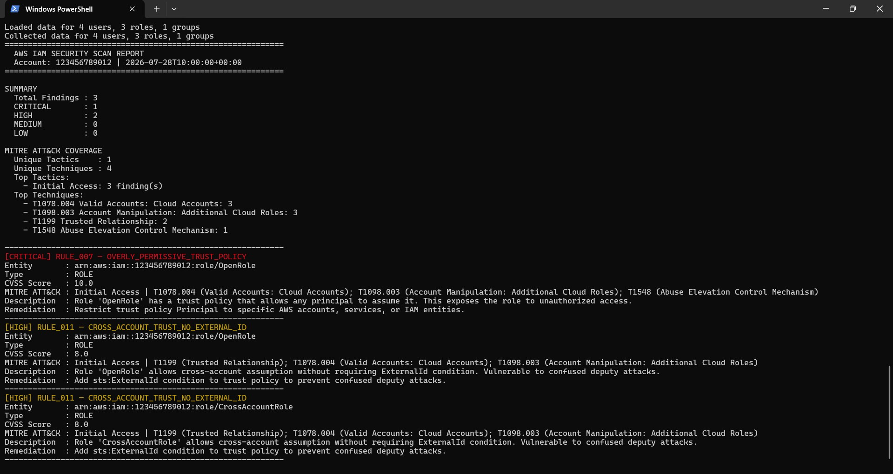
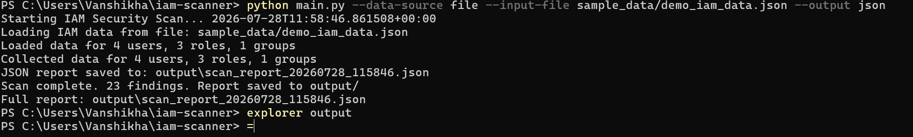

# CloudSentinel — Cloud IAM Security Analysis Platform

*Evolved from the **AWS IAM Security Scanner***

A Python-based security tool that scans AWS IAM configurations for
misconfigurations, privilege escalation paths, and compliance gaps — now
available both as a command-line scanner and as a REST API.



---

## Why I Built This

IAM misconfiguration is the **major** of AWS account compromise. Tools like this automate what a security engineer would manually check during a cloud security audit.
The goal was to understand both the **attack surface** (what misconfigurations enable privilege escalation) and the **detection logic** (how to programmatically identify them at scale).

---

## What Problem Does This Solve?

Misconfigured IAM policies remain one of the leading causes of cloud breaches. This tool
automatically detects dangerous permission patterns that manual audits
miss, and generates actionable remediation steps.

---

## From Scanner to CloudSentinel

The project started as a standalone CLI scanner and has grown in layers. Each
layer wraps the one below it without changing it:

```
AWS IAM Security Scanner        scanner/  + main.py
  12 rules, risk scoring, MITRE ATT&CK, terminal/JSON reports, CLI
        │
        ▼
CloudSentinel service layer     cloudsentinel/services/
  Scan orchestration as a reusable Python API: structured reports,
  stable finding IDs, filtering, rule catalog
        │
        ▼
FastAPI REST API                cloudsentinel/api/
  HTTP/JSON access to the same analysis
```

The original scanner remains the **security analysis engine**: every finding
is produced by the same rule engine, risk scorer and MITRE ATT&CK mapper.
CloudSentinel is the service/API layer around it. The scanner core was not
rewritten, and the CLI (`main.py`) works exactly as before.

---

## Architecture

```
  CLI path                                 API path

  CLI user                                 API client
     │                                        │ HTTP/JSON (IAM data in request body)
     ▼                                        ▼
  main.py                                  FastAPI  (cloudsentinel/api/)
     │                                        │
     ▼                                        ▼
  IAM Collector                            ScanService  (cloudsentinel/services/)
  live AWS IAM (read-only)                 no IAM Collector, no AWS calls
  or exported JSON file                       │
     │                                        │
     └───────────────────┬────────────────────┘
                         ▼
           IAM Security Engine  (scanner/)
             ├── Rule Engine  (uses Policy Parser)
             ├── Risk Scorer
             └── MITRE ATT&CK Mapper
                         │
            ┌────────────┴────────────┐
            ▼                         ▼
  CLI: Report Generator      API: JSON response
  (terminal / JSON file)     (report with finding IDs)
```

| Layer | Responsibility |
|-------|----------------|
| **FastAPI REST API** (`cloudsentinel/api/`) | HTTP endpoints, Pydantic request/response validation, HTTP status codes. Route handlers are thin and contain no scanning logic. |
| **Service layer** (`cloudsentinel/services/`) | `ScanService` runs the rule engine on IAM data already loaded in Python, applies filters, assigns stable finding IDs and builds the report. `rule_catalog` reads the rule definitions. No file writes, no stdout, no AWS calls. |
| **IAM Collector** (`scanner/iam_collector.py`) | Used by the CLI: collects IAM data from AWS (read-only) or loads an exported JSON file. The API does not call AWS — it analyzes the IAM data it receives. |
| **Rule Engine** (`scanner/rule_engine.py`) | Runs the 12 security rules and produces findings. |
| **Policy Parser** (`scanner/policy_parser.py`) | Analyzes policy documents for wildcards, dangerous actions and conditions. |
| **Risk Scorer** (`scanner/risk_scorer.py`) | Calculates a 0–10 score per finding from severity and contextual modifiers. |
| **MITRE ATT&CK Mapper** (`scanner/mitre_attack.py`) | Attaches ATT&CK techniques/tactics to findings and builds coverage summaries. |
| **Report Generator** (`scanner/report_generator.py`) | Used by the CLI: colorized terminal report and JSON report files. |

---

## Key Features

### IAM security scanner

- Detects overly permissive IAM policies (wildcard actions and resources)
- Identifies users with console access but no MFA enabled
- Flags stale and unrotated access keys
- Detects privilege escalation permissions (e.g., iam:CreatePolicyVersion, iam:PassRole, iam:AttachUserPolicy)
- Analyzes role trust policies for overly permissive principals (`*`) and missing ExternalId conditions
- Checks account password policy strength
- Flags direct policy attachments to users instead of groups
- Custom CVSS-inspired risk scoring with contextual modifiers
- **MITRE ATT&CK mapping** for every finding (tactics + techniques + rationale)
- ATT&CK coverage summary in terminal and JSON reports
- Colorized terminal reports + exportable JSON reports
- CLI filters by minimum severity and entity type
- Support for **live AWS scanning** and **offline file-based analysis**
- Loads pre-collected IAM data (compatible with exported JSON or tools like BishopFox iam-vulnerable)
- Uses AWS paginators for reliable results on large accounts
- Fully read-only — no changes are made to your AWS environment

### CloudSentinel

- REST API for programmatic IAM security analysis
- JSON-based scan requests and responses (same IAM JSON format as offline file mode)
- Severity and entity-type filtering
- Stable finding IDs (`finding_id`) that stay the same across rescans
- Rule catalog endpoint (`GET /rules`)
- FastAPI interactive API documentation (`/docs`)
- Service-layer separation between the API and the security engine
- Automated scanner, service and API tests (119 tests)

---

## Tech Stack

| Tool / Framework  | Purpose                                      |
|-------------------|----------------------------------------------|
| Python 3.11       | Core language (test suite verified on 3.11)  |
| Boto3             | AWS SDK for IAM data collection              |
| colorama          | Colored terminal output                      |
| python-dateutil   | Timezone-aware datetime handling             |
| MITRE ATT&CK      | Maps IAM findings to adversary tactics/techniques |
| FastAPI           | REST API framework                           |
| Pydantic          | Request/response validation                  |
| Uvicorn           | ASGI server for running the API              |
| pytest            | Unit and API testing with mocked IAM data    |
| httpx             | HTTP client used by FastAPI's TestClient in API tests |

---

## Project Structure

```
iam-scanner/
├── scanner/                     # IAM security engine (original scanner core)
│   ├── __init__.py
│   ├── iam_collector.py         # Collects IAM data (live or from file)
│   ├── policy_parser.py         # Analyzes policy documents
│   ├── rule_engine.py           # Runs all 12 security rules
│   ├── risk_scorer.py           # Calculates risk scores
│   ├── mitre_attack.py          # MITRE ATT&CK technique mappings
│   └── report_generator.py      # Terminal + JSON reporting (CLI)
├── cloudsentinel/               # CloudSentinel service + API layer
│   ├── __init__.py
│   ├── api/
│   │   ├── app.py               # FastAPI app, GET /health
│   │   ├── schemas.py           # Pydantic request/response models
│   │   └── routes/
│   │       ├── scans.py         # POST /scans
│   │       └── rules.py         # GET /rules
│   └── services/
│       ├── scan_service.py      # ScanService: scan, filter, finding IDs, report
│       └── rule_catalog.py      # Reads rules/rules_config.json
├── rules/
│   └── rules_config.json        # Rule metadata + ATT&CK mappings
├── sample_data/
│   └── demo_iam_data.json       # Offline demo IAM dataset (no AWS needed)
├── tests/
│   ├── test_rules.py            # Scanner tests (rules, scoring, MITRE)
│   ├── services/
│   │   └── test_scan_service.py # Service-layer tests
│   └── api/
│       ├── conftest.py          # Shared fixtures; blocks AWS/network calls
│       ├── test_scans.py        # /health and /scans tests
│       └── test_rules.py        # /rules tests
├── screenshots/                 # README screenshots
├── output/                      # Generated CLI reports (gitignored)
├── main.py                      # CLI entry point
├── Dockerfile                   # Container image for the REST API
├── .dockerignore                # Keeps the build context small
└── requirements.txt
```

---

## Setup

1. Clone the repository:
   ```bash
   git clone https://github.com/Wanderernet12345/aws-iam-scanner-.git
   cd aws-iam-scanner-
   ```

2. Install dependencies (Python 3.11 recommended):
   ```bash
   pip install -r requirements.txt
   ```

3. **Only for live AWS scans with the CLI**, configure AWS credentials (one of the following):
   - Run `aws configure`
   - Use a named profile: `--profile myprofile`
   - Set environment variables (`AWS_ACCESS_KEY_ID`, `AWS_SECRET_ACCESS_KEY`)

   The REST API and the CLI's file mode need no AWS credentials.

> **Note**: The scanner is read-only. It only requires `iam:*` read/list permissions. The `ReadOnlyAccess` AWS managed policy works well.

---

## CLI Usage

### Live AWS Scan (Default)

```bash
python main.py
```

Common options:

```bash
# Filter by severity
python main.py --severity HIGH

# Output formats
python main.py --output both
python main.py --output json

# Use a specific AWS profile
python main.py --profile production

# Filter by entity type
python main.py --entity-type USER
```

### File Mode (Offline / Pre-collected Data)

Load data from a previously exported JSON file. Useful for:
- Offline analysis
- CI/CD pipelines
- Testing with synthetic data (e.g. from BishopFox iam-vulnerable)

```bash
# Demo dataset included in this repo (no AWS credentials needed)
python main.py --data-source file --input-file sample_data/demo_iam_data.json

# Combine with other options
python main.py --data-source file --input-file sample_data/demo_iam_data.json --severity CRITICAL --output both
python main.py --data-source file --input-file sample_data/demo_iam_data.json --output both
```

<details>
<summary>CLI help text (<code>python main.py --help</code>)</summary>

```text
usage: main.py [-h] [--severity {CRITICAL,HIGH,MEDIUM,LOW,INFO}]
               [--output {terminal,json,both}]
               [--entity-type {USER,ROLE,GROUP,ACCOUNT}] [--profile PROFILE]
               [--data-source {live,file}] [--input-file INPUT_FILE]

AWS IAM Security Misconfiguration Scanner

options:
  -h, --help            show this help message and exit
  --severity {CRITICAL,HIGH,MEDIUM,LOW,INFO}
                        Minimum severity to include in report (default: show
                        all)
  --output {terminal,json,both}
                        Output format (default: terminal)
  --entity-type {USER,ROLE,GROUP,ACCOUNT}
                        Filter findings to specific entity type (default: all)
  --profile PROFILE     AWS profile name to use from ~/.aws/credentials
                        (default: default profile)
  --data-source {live,file}
                        Source of IAM data: 'live' to query AWS in real-time,
                        or 'file' to load from a pre-collected JSON (default:
                        live)
  --input-file INPUT_FILE
                        Path to JSON file containing IAM data (required when
                        --data-source=file)

Examples:
  python main.py
  python main.py --severity CRITICAL --output both
  python main.py --profile prod --entity-type ROLE
  python main.py --output json --severity HIGH

  # Load data from exported JSON file (no live AWS calls)
  python main.py --data-source file --input-file exported_data.json
```
</details>

### CLI Output

- **Terminal Report**: Color-coded by severity, with ATT&CK mapping, description and remediation per finding.
- **JSON Report**: Saved to `output/scan_report_YYYYMMDD_HHMMSS.json` with scan metadata, summary counts, `mitre_attack_summary` and all findings sorted by risk score.

Terminal output for the demo dataset (colorized in an actual terminal):

```
============================================================
  AWS IAM SECURITY SCAN REPORT
  Account: 123456789012 | 2026-07-28T10:00:00+00:00
============================================================

SUMMARY
  Total Findings : 23
  CRITICAL       : 4
  HIGH           : 8
  MEDIUM         : 7
  LOW            : 4

MITRE ATT&CK COVERAGE
  Unique Tactics    : 5
  Unique Techniques : 12
  ...
------------------------------------------------------------
[CRITICAL] RULE_001 — ROOT_ACCOUNT_NO_MFA
Entity       : arn:aws:iam::root
Type         : ACCOUNT
CVSS Score   : 10.0
MITRE ATT&CK : Privilege Escalation | T1078.004 (Valid Accounts: Cloud Accounts)
Description  : Root account does not have MFA enabled. Root account has unrestricted access to all AWS resources.
...
```

---

## REST API Usage

### Start the API

```bash
uvicorn cloudsentinel.api.app:app --reload
```

The API runs at `http://127.0.0.1:8000`. Interactive documentation is at
[http://127.0.0.1:8000/docs](http://127.0.0.1:8000/docs).

### Endpoints

| Method | Path | Description |
|--------|------|-------------|
| GET  | `/health` | Health check — returns `{"status": "ok"}` |
| POST | `/scans`  | Scan IAM data sent as JSON and return the report |
| GET  | `/rules`  | List the 12 security rules from `rules/rules_config.json` |
| GET  | `/docs`   | FastAPI interactive API documentation (Swagger UI) |

### `POST /scans`

**Request body** — the same IAM JSON structure accepted by the offline
scanner (`--data-source file`), e.g. `sample_data/demo_iam_data.json`:

| Field | Type |
|-------|------|
| `account_id` | string |
| `scan_time` | string |
| `users`, `groups`, `roles` | lists of objects |
| `password_policy`, `account_summary` | objects |

All fields are optional. Only this top-level structure is validated; the
contents of users, roles, groups and policies are passed to the scanner
unchanged. The API does not connect to AWS.

**Query parameters** (optional, case-insensitive):

| Parameter | Values |
|-----------|--------|
| `min_severity` | `CRITICAL`, `HIGH`, `MEDIUM`, `LOW`, `INFO` |
| `entity_type` | `USER`, `ROLE`, `GROUP`, `ACCOUNT` |

Invalid filter values or a malformed body return **HTTP 422**.

**Examples** (on Windows PowerShell, use `curl.exe`):

```bash
# Health check
curl http://127.0.0.1:8000/health

# Normal scan of the demo dataset (23 findings)
curl -X POST http://127.0.0.1:8000/scans \
  -H "Content-Type: application/json" \
  --data @sample_data/demo_iam_data.json

# Severity filtering: HIGH and above (12 findings)
curl -X POST "http://127.0.0.1:8000/scans?min_severity=HIGH" \
  -H "Content-Type: application/json" \
  --data @sample_data/demo_iam_data.json

# Entity-type filtering: roles only (3 findings)
curl -X POST "http://127.0.0.1:8000/scans?entity_type=ROLE" \
  -H "Content-Type: application/json" \
  --data @sample_data/demo_iam_data.json

# Rule catalog
curl http://127.0.0.1:8000/rules
```

Python (using `httpx`, installed with the requirements):

```python
import json
import httpx

with open("sample_data/demo_iam_data.json", encoding="utf-8") as f:
    iam_data = json.load(f)

response = httpx.post(
    "http://127.0.0.1:8000/scans",
    params={"min_severity": "HIGH", "entity_type": "USER"},
    json=iam_data,
)
response.raise_for_status()
report = response.json()

print(report["summary"])
for finding in report["findings"]:
    print(finding["finding_id"], finding["severity"], finding["rule_name"], finding["affected_entity"])
```

**Response** (demo dataset, no filters; abbreviated):

```json
{
  "scan_metadata": {
    "account_id": "123456789012",
    "scan_time": "2026-07-28T10:00:00+00:00",
    "total_entities_scanned": {"users": 4, "roles": 3, "groups": 1},
    "frameworks": ["Custom IAM Rules", "MITRE ATT&CK"]
  },
  "filters": {"min_severity": null, "entity_type": null, "total_findings_before_filter": 23},
  "summary": {"total_findings": 23, "critical": 4, "high": 8, "medium": 7, "low": 4},
  "mitre_attack_summary": {"framework": "MITRE ATT&CK", "unique_techniques": 12, "unique_tactics": 5, "...": "..."},
  "findings": [
    {
      "finding_id": "fnd_5394ff37dd663fcf",
      "rule_id": "RULE_001",
      "rule_name": "ROOT_ACCOUNT_NO_MFA",
      "severity": "CRITICAL",
      "affected_entity": "arn:aws:iam::root",
      "entity_type": "ACCOUNT",
      "description": "Root account does not have MFA enabled. Root account has unrestricted access to all AWS resources.",
      "remediation": "Enable MFA on root account immediately. Use a hardware MFA device if possible.",
      "cvss_score": 10.0,
      "mitre_attack": {
        "framework": "MITRE ATT&CK",
        "primary_tactic": "Privilege Escalation",
        "techniques": [{"technique_id": "T1078.004", "technique_name": "Valid Accounts: Cloud Accounts", "...": "..."}],
        "...": "..."
      }
    }
  ]
}
```

Findings are sorted by `cvss_score` (highest first). `summary` counts the
filtered findings; `filters.total_findings_before_filter` gives the total
before filtering.

**Invalid filter:**

```json
HTTP 422
{"detail": "Invalid min_severity 'SEVERE'. Expected one of: CRITICAL, HIGH, MEDIUM, LOW, INFO"}
```

### Stable finding IDs

Each finding gets a `finding_id` such as `fnd_5394ff37dd663fcf`. It is a hash
of the account ID, rule ID, entity type, affected entity and description,
with standalone numbers masked, so the same misconfiguration keeps the same
ID across rescans even as values like "not used in 240 days" change. If two
findings in one scan would share an ID, later ones get a `-2`, `-3`, …
suffix.

### `GET /rules`

Returns the rule definitions from `rules/rules_config.json` (not a second
hardcoded list):

```json
{
  "version": "1.1",
  "total": 12,
  "rules": [
    {
      "rule_id": "RULE_001",
      "rule_name": "ROOT_ACCOUNT_NO_MFA",
      "severity": "CRITICAL",
      "description": "Root account does not have MFA enabled.",
      "remediation": "Enable MFA on root account immediately.",
      "mitre_attack": {
        "primary_tactic": "Privilege Escalation",
        "technique_ids": ["T1078.004"],
        "rationale": "Root without MFA is a high-value valid cloud account. ..."
      }
    }
  ]
}
```

---

## Docker

The `Dockerfile` packages the REST API on a `python:3.11-slim` base. The
image contains only what the API needs (`scanner/`, `cloudsentinel/`,
`rules/` and the installed requirements), runs as a non-root user, and
starts:

```
uvicorn cloudsentinel.api.app:app --host 0.0.0.0 --port 8000
```

The container does not need AWS credentials: it analyzes the IAM data sent
to `POST /scans`.

**Build the image** (from the repository root):

```bash
docker build -t cloudsentinel-api .
```

**Run the container:**

```bash
docker run -d --rm --name cloudsentinel -p 8000:8000 cloudsentinel-api
```

**Check it is running:**

```bash
curl http://127.0.0.1:8000/health
# {"status":"ok"}
```

**Interactive API docs:** open [http://127.0.0.1:8000/docs](http://127.0.0.1:8000/docs) in a browser.

The container serves the same API on the same port, so all examples in
[REST API Usage](#rest-api-usage) work against it unchanged.

**Stop the container** (it is removed automatically because of `--rm`):

```bash
docker stop cloudsentinel
```

---

## Available Detection Rules

The scanner implements 12 rules (also available from `GET /rules`). Each rule is mapped to MITRE ATT&CK techniques:

| Rule ID  | Name                                      | Severity  | Primary ATT&CK Tactic | Key Techniques |
|----------|-------------------------------------------|-----------|-----------------------|----------------|
| RULE_001 | Root account has no MFA                   | CRITICAL  | Privilege Escalation  | T1078.004 |
| RULE_002 | IAM user has console access but no MFA    | HIGH      | Initial Access        | T1078.004 |
| RULE_003 | Policy grants full administrative access (`*:*`) | CRITICAL | Privilege Escalation | T1078.004, T1098, T1548 |
| RULE_004 | Stale access key (unused > 90 days)       | HIGH      | Credential Access     | T1078.004, T1552 |
| RULE_005 | Access key older than 90 days             | MEDIUM    | Credential Access     | T1078.004, T1552 |
| RULE_006 | Inline policy with wildcard permissions   | HIGH      | Privilege Escalation  | T1078.004, T1098 |
| RULE_007 | Overly permissive role trust policy (`*`) | CRITICAL  | Initial Access        | T1078.004, T1098.003, T1548 |
| RULE_008 | Privilege escalation permissions          | HIGH      | Privilege Escalation  | T1098, T1098.001, T1098.003, T1136.003, T1078.004 |
| RULE_009 | Weak account password policy              | MEDIUM    | Credential Access     | T1110, T1078 |
| RULE_010 | Direct policy attachment to user          | LOW       | Persistence           | T1098, T1078.004 |
| RULE_011 | Cross-account trust without ExternalId    | HIGH      | Initial Access        | T1199, T1078.004, T1098.003 |
| RULE_012 | Broad permissions with no conditions      | MEDIUM    | Collection            | T1078.004, T1530, T1580 |

### MITRE ATT&CK Integration

Findings include:

- **Primary tactic** (e.g. Privilege Escalation, Credential Access)
- **Technique IDs and names** (e.g. `T1078.004` Valid Accounts: Cloud Accounts)
- **Official ATT&CK URLs** for further research
- **Rationale** explaining why the misconfiguration maps to that technique

Terminal reports show a **MITRE ATT&CK COVERAGE** block (unique tactics/techniques).
JSON reports and API responses include `mitre_attack` on every finding plus a top-level `mitre_attack_summary`.

Reference: [https://attack.mitre.org/](https://attack.mitre.org/)

---

## Screenshots

### Full Scan with MITRE ATT&CK Coverage

```bash
python main.py --data-source file --input-file sample_data/demo_iam_data.json
```


### Finding Details

Each finding shows its entity, CVSS score, ATT&CK mapping, description and remediation:



### Severity Filter

```bash
python main.py --data-source file --input-file sample_data/demo_iam_data.json --severity CRITICAL
```



### Entity-Type Filters

```bash
python main.py --data-source file --input-file sample_data/demo_iam_data.json --entity-type USER --severity HIGH
```



`--entity-type ROLE` (3 role findings):



### JSON Report Export

```bash
python main.py --data-source file --input-file sample_data/demo_iam_data.json --output json
```



---

## Testing

Run the full suite from the repository root:

```bash
python -m pytest
```

Current verified result (Python 3.11): **119 tests passed**

| Suite | Location | Tests |
|-------|----------|-------|
| Scanner (rules, risk scoring, MITRE ATT&CK) | `tests/test_rules.py` | 33 |
| Service layer | `tests/services/test_scan_service.py` | 59 |
| REST API (FastAPI TestClient) | `tests/api/` | 27 |
| **Total** | | **119** |

Run a single suite:

```bash
python -m pytest tests/test_rules.py
python -m pytest tests/services
python -m pytest tests/api
```

All tests use synthetic or demo IAM data. Service and API tests use
`sample_data/demo_iam_data.json` as their main fixture, and the API tests
block AWS SDK usage and outbound network connections, so no real AWS calls
are made.

---

## Project Status

**Completed**

- IAM scanner core with live IAM collection and full pagination
- Policy parsing and 12 security rules
- Risk scoring
- MITRE ATT&CK integration
- CLI and file-based (offline) scanning with terminal + JSON reporting
- CloudSentinel service layer (`ScanService`, rule catalog, stable finding IDs)
- FastAPI REST API (`/health`, `/scans`, `/rules`, `/docs`)
- Automated testing: 119 tests across scanner, service and API

CloudSentinel is under active development; further layers will be documented here once they are implemented.

---

## Author

Vanshikha | B.Tech Cybersecurity, SSPU Pune
(https://www.linkedin.com/in/vanshikha-panwar/)
